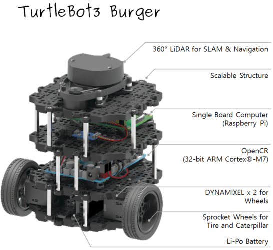
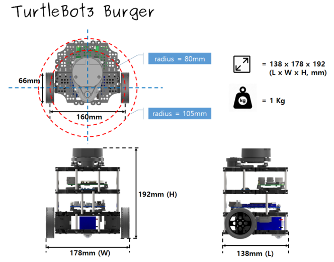
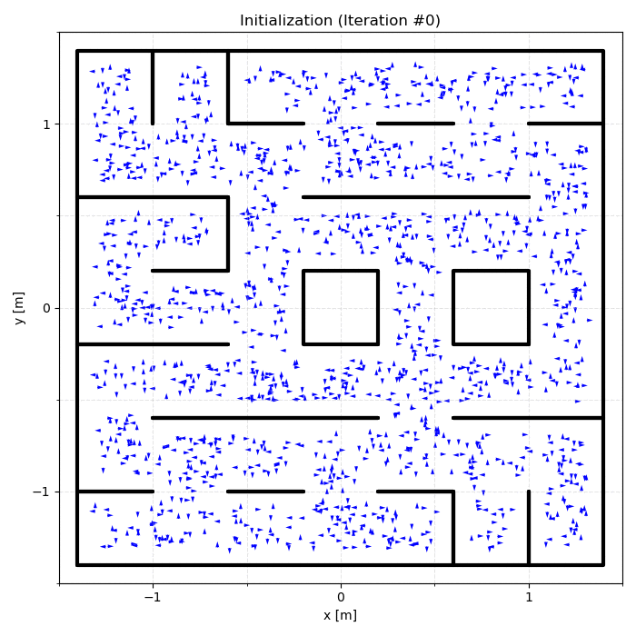
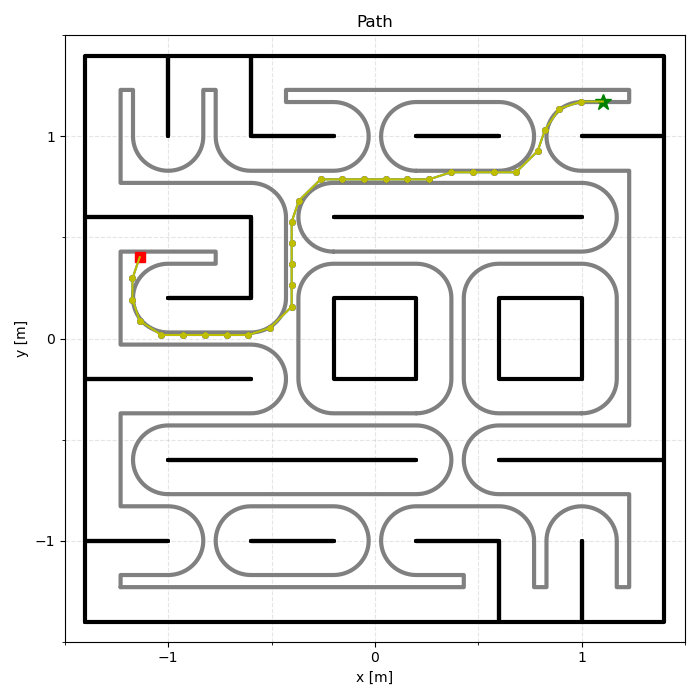

# Autonomous ROS 2 Navigation Stack

A complete ROS 2 (Humble) navigation pipeline designed for differential-drive mobile robots. This repository implements an end-to-end autonomous system—from raw simulated sensor processing and probabilistic localization to collision-free path planning and closed-loop trajectory tracking.

Built and validated using the TurtleBot3 Burger platform within CoppeliaSim, this project demonstrates a modular, scalable approach to modern robotics software architecture.

## System Overview

- **Robust State Estimation:** Custom Particle Filter (MCL) implementation with likelihood-based resampling and DBSCAN clustering for reliable convergence detection.
- **Hybrid Control Strategy:** Autonomous exploration via PID wall-following, seamlessly transitioning to a Pure Pursuit controller once global localization is achieved.
- **Dynamic Motion Planning:** Graph/search-based planning (RRT* / A*) for optimal, collision-free routing.
- **Modular Architecture:** Strictly separated ROS 2 packages for control, localization, planning, simulation bridging, and custom message definitions (`amr_msgs`).

## Hardware Platform: TurtleBot3 Burger

This project utilizes the TurtleBot3 Burger kinematic model. The platform features two differential drive wheels, a rear caster wheel, and a 360-degree LiDAR for environmental perception.

|                                Components                                |                            Dimensions                             |
| :----------------------------------------------------------------------: | :---------------------------------------------------------------: |
|  |  |

## System Demonstration

The following captures demonstrate the synchronized execution of the particle filter, the CoppeliaSim environment, and the resulting computed path.

<table>
  <tr>
    <td align="center"><b>Localization (Particle Filter)</b></td>
    <td align="center"><b>Simulation (CoppeliaSim)</b></td>
    <td align="center"><b>Global Path Planning</b></td>
  </tr>
  <tr>
    <td></td>
    <td></td>
    <td></td>
  </tr>
</table>

## Software Architecture & Tech Stack

- **Framework:** ROS 2 Humble (`rclpy`, `launch`, `nav_msgs`, `sensor_msgs`, `geometry_msgs`)
- **Simulation Environment:** CoppeliaSim via ZMQ Remote API
- **Core Computation:** Python Scientific Stack (`NumPy`, `SciPy`, `scikit-learn`, `Shapely`)
- **Synchronization:** ROS `message_filters` for time-aligned sensor processing

## Repository Structure

```text
├── real/                  # Hardware-specific bringup and teleop configurations
├── simulation/            # Simulation workspace
│   ├── src/
│   │   ├── amr_control/       # PID Wall Follower & Pure Pursuit controllers
│   │   ├── amr_localization/  # Particle Filter (MCL) & mapping utilities
│   │   ├── amr_planning/      # RRT* / A* planners
│   │   ├── amr_simulation/    # CoppeliaSim bridge and simulation manager
│   │   └── amr_msgs/          # Custom ROS 2 interfaces (e.g., PoseStamped)
└── assets/                # Documentation media
```

## Getting Started

### Prerequisites

- Ubuntu 22.04 with ROS 2 Humble (or the provided `.devcontainer`)
- CoppeliaSim (installed on host)
- Python 3.10+

### Installation (Simulation Environment)

**Option A (Recommended):** Use the included VS Code Dev Container alongside a host installation of CoppeliaSim. Required dependencies (e.g., `coppeliasim-zmqremoteapi-client`) are pre-configured.

**Option B (Manual Build):**

```bash
# 1. Source ROS 2 environment
source /opt/ros/humble/setup.bash

# 2. Navigate to simulation workspace
cd simulation

# 3. Install Python dependencies
python3 -m pip install -r ../.devcontainer/requirements.txt

# 4. Install ROS dependencies
rosdep install --from-paths src --ignore-src -r -y
```

## Execution

1. Launch CoppeliaSim and load the environment scene:
   `simulation/src/amr_simulation/worlds/project_sim.ttt`
   _(Note: Leave the simulation paused; the ROS node will manage the execution state)._

2. Launch the complete navigation stack:

```bash
cd simulation
source /opt/ros/humble/setup.bash
colcon build --symlink-install
source install/setup.bash
ros2 launch launch/project_sim.launch.py
```

**Execution Flow:**

1. `wall_follower` node initiates environmental exploration.
2. `particle_filter` node processes LiDAR data until pose converges.
3. `rrt_star` (or `A*`) computes an optimal trajectory to the target.
4. `pure_pursuit` assumes control for path tracking.
5. `coppeliasim` node logs runtime statistics and confirms goal acquisition.

## Configuration

Core pipeline parameters can be modified directly in the launch file: `simulation/launch/project_sim.launch.py`.

- `start`: Initial configuration `(x, y, theta)`
- `goal`: Target coordinates `(x, y)`
- `n_particles`: Resolution of the particle filter
- `enable_plots`: Toggle visual debugging outputs
